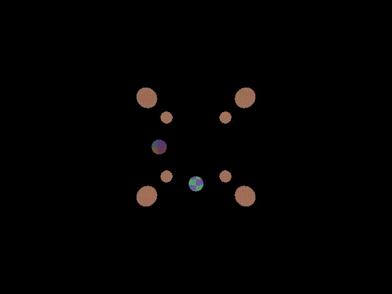
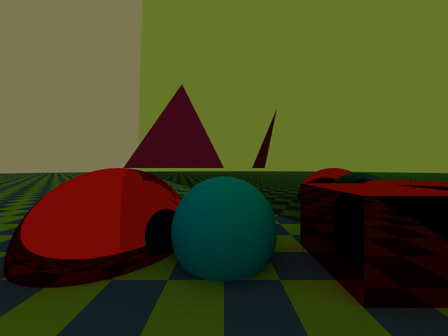

# Raytracing

<!-- ALL-CONTRIBUTORS-BADGE:START - Do not remove or modify this section -->
[](#contributors-)
<!-- ALL-CONTRIBUTORS-BADGE:END -->

 


 

[](https://codecov.io/gh/cosmofico97/Raytracing)
[](https://cosmofico97.github.io/Raytracing/stable) 
[](https://cosmofico97.github.io/Raytracing/dev)  

This software is a simple raytracing program written in the [Julia Programming Language](https://julialang.org).
It's based on the lectures of the [*Numerical techniques for photorealistic image generation*]( https://www.unimi.it/en/education/degree-programme-courses/2021/numerical-tecniques-photorealistic-image-generation) course (AY2020-2021), held by Associate Professor [Maurizio Tomasi](http://cosmo.fisica.unimi.it/persone/maurizio-tomasi) at University of Milan [Department of
Physics "Aldo Pontremoli"](http://eng.fisica.unimi.it/ecm/home).

## Table of Contents

- [Raytracing](#raytracing)
  - [Table of Contents](#table-of-contents)
  - [Installation](#installation)
  - [Demo and Demo Animation](#demo-and-demo-animation)
  - [Usage from the Command Line Interface](#usage-from-the-command-line-interface)
  - [Usage from the REPL](#usage-from-the-repl)
  - [Licence](#licence)
  - [Contributors ✨](#contributors-)

## Installation

The simplest way to install this software is cloning the repository where it is built in. Run in the command line
```bash
git clone https://github.com/cosmofico97/Raytracing
```
or download the source code from the github repository https://github.com/cosmofico97/Raytracing.


## Demo and Demo Animation

To start off and check the correct behavior of this software run one of the following command inside the main directory
```bash
./Raytracer.jl demo_animation --camera_type=per --width=640 --height=480 flat
```
```bash
./Raytracer.jl demo --world_type=B --camera_type=per --camera_position="[-1, 0, 1]" --width=640 --height=480 pathtracing 
```
and enjoy respectively the animation `demo/demo_anim_Flat_640x480x360.mp4` and the image `demo/demo_B_PathTracing_640x480.png`

<!---
<video width="640" height="480"  type="video/mp4" "src="https://user-images.githubusercontent.com/79974922/119556147-ef2b3200-bd9e-11eb-956f-17de6ea6bdda.mp4"  autoplay loop> </video>"
-->

Demo Animation A  with FlatRenderer       | Demo Image B with PathTracing
:----------------------------------------:|:-------------------------:
  |  

It may takes few minutes to render the animation; you might also give smaller (integer and even) values to `--width` and `--height` in order to obtain the same animation in a smaller amount of time (the price to pay is a worse definition of the animation itself).


## Usage from the Command Line Interface

This software is able to read a file that describes a scene (i.e a set of objects, pigments, materials, etc. that we want  render).
To understand how to write such a file, take a look at the [tutorial_basic_sintax.txt](examples/tutorial_basic_sintax.txt) and the [demo_world_B.txt](examples/demo_world_B.txt) files in the [examples](esamples) directory.

The basic structure of a command in the CLI is the following:

```bash
./Raytracer.jl render [OPTIONS_FOR_THE_IMAGE] NAME_OF_THE_SCENEFILE {onoff|flat|pathtracer|pointlight}[OPTIONS_FOR_THE_RENDERER]
```
```bash
./Raytracer.jl animation --function=FUNCTION_NAME  --vec_variables="[NAMEVAR1, NAMEVAR2, ...]" --iterable=ITERABLE [OPTIONS_FOR_THE_IMAGE] NAME_OF_THE_SCENEFILE {onoff|flat|pathtracer|pointlight}[OPTIONS_FOR_THE_RENDERER]
```

There are four possible rendering algorithms; each of them is linked to different rules for the color of a pixel and the light ray that starts from that pixel and hits (or not) an object of the rendered scene:

- `onoff` : each pixel is set to the `background_color` if no shape is hit by its light ray, otherwise is set to `color`; this renderer exists only for debugging purposes.
 
- `flat` : each pixel is set to the `background_color` if no shape is hitten by its light ray, otherwise is set to the color of the hitted shape point.
  This renderer is very efficient, but it does not solve the rendering equation, and consequently no shadows or brightness are rendered.

- `pathtracer` : this is the TRUE renderer. It solves the rendering equation in the "standard" way, and for this reason it's very demanding.
  Nevertheless, the rendered images are incomparably more realistic than the ones made with the other three renderers; USE THIS RENDERER WITH FORESIGHT!

- `pointlight` : it's the "cheap solution" for a realistic image. This renderer creates an image setting each pixel colored or not depending on the "line of sight" between that point and the point-light sources in the scene.
  It's very efficient, and the images rendered are perfect for an astrophysical context or for very bright days of summer. Nevertheless it's a simple solution in order to avoid the longer times needed for the pathtracer algorithm.

The resulting files created at the end of the rendering are three:
- the PFM image (`scene.pfm` is the default name, if none is specified from the command line)
- the LDR image (`scene.png` is the default name, if none is specified from the command line)
-  the JSON file, that saves some datas about input commands, rendering time etc. It has the same name of the LDR image and `.json` extention, so `scene.json` is the default name.

The resulting files created at the end of the animation are intead two:
- the animation (`scene_animation.mp4` is the default name, if none is specified from the command line)
-  the JSON file; it has the same name of the animation and `.json` extention, so `scene_animation.json` is the default name.
  
Probably, the LDR image will not be "correctly" converted with the standard values used in the `render` function to tone-map the PFM file; it's consequently appropriate
to manually apply the tone mapping algorithm to the PFM image!
The tonemapping command is simple:
```bash
./Raytracer.jl tonemapping [--normalization ALPHA] [-gamma GAMMA] [--avg_lum LUM]FILE_PFM_TO_BE_TONEMAPPED NAME_OF_THE_RESULTING_LDR
```
where `ALPHA` is the scaling factor for the normalisation process (default `a=0.18`), `GAMMA` is YOUR monitor gamma value (default `g=1.0`) and `LUM` is the average luminosity of the image (the default value is manually calculated for the image itself, but it's useful to specify manually this value for particularly dark images).
Choose your `ALPHA` and `GAMMA` values without any fear to try again! This algorithm is indeed by far more efficient and computationally cheaper than the rendering.

NOTE: you can also specify `ALPHA`, `GAMMA` and `LUM` in the render and animation command; it's fundamental for the latter case, because no "PFM-animation" that can be tonemappend exists!


Here we show an example of usage, which renders the [earth_and_sun.txt](examples/earth_and_sun.txt) file
```bash
./Raytracer.jl render examples/earth_and_sun.txt --width=2880 --height=1800 flat
```
and of the tone-map the resulting PFM
```bash
./Raytracer.jl tonemapping scene.pfm scene.png --normalization=0.18 --gamma=1.0
```

Earth with FlatRenderer            | 
:---------------------------------:|
 

We show also an animation example of usage, which renders the [earth_moon_sun.txt](examples/earth_moon_sun.txt) file
```bash
./Raytracer.jl animation  --normalization=0.18 --gamma=1.0 --avg_lum=0.025 --function=earth_moon_sun --vec_variables="[moon_x,  moon_y, moon_z,  moon_rotang, earth_rotang]" --iterable=1:100 examples/earth_moon_sun.txt pointlight
```

Refer to the latest [stable documentation](https://cosmofico97.github.io/Raytracing/stable) for explanation of the functions used.


## Usage from the REPL

If you prefer to use the Julia REPL, first of all you need to include the software with the known command in the REPL:

```julia
include("Raytracer.jl")

```

You can obviously visualize the options for each function thanks to the help option (by typing `?`, than write the function name) and set the parameters in a dictionary-like sintax.
The only main difference is that in order to specify the renderer algorithm, the key is the not-so-intuitive string `%COMMAND%` (due to the [`ArgParse.jl`](https://github.com/carlobaldassi/ArgParse.jl) package used for the command line parsing operation).

For example, in order to render the demo image B previously showed:
```julia
demo("camera_type"=>"ort", "world_type"=>"B", "camera_position"=>"[-1, 0, 1]", "width"=>640, "height"=>480, "%COMMAND%"=>"flat")
```

Instead, for rendering the `examples/earth_and_sun.txt`
```julia
render("scenefile"=>"examples/earth_and_sun.txt", "width"=>2880, "height"=>1880, "%COMMAND%"=>"flat")
```
and for tone-map it
```julia
tone_mapping("infile"=>"scene.pfm", "outfile"=>"scene.png", "alpha"=>0.18, "gamma"=>0.6)
```

Finally, to create the  `examples/earth_moon_sun.txt` animation:
```julia
render_animation("normalization"=>0.18, "gamma"=>1.0, "avg_lum"=>0.025, "width"=>1440, "height"=>900, "function"=>"earth_moon_sun", "vec_variables"=>"[moon_x,  moon_y, moon_z,  moon_rotang, earth_rotang]", "iterable"=>"1:100", "scenefile"=>"examples/earth_moon_sun.txt", "%COMMAND%"=>"pointlight")
```

## Licence
All the files in this repository are under a MIT license. See the file [LICENSE.md](./LICENSE.md)


## Contributors ✨

Thanks goes to these wonderful people ([emoji key](https://allcontributors.org/docs/en/emoji-key)):

<!-- ALL-CONTRIBUTORS-LIST:START - Do not remove or modify this section -->
<!-- prettier-ignore-start -->
<!-- markdownlint-disable -->
<table>
  <tr>
    <td align="center"><a href="http://ziotom78.blogspot.it/"><br /><sub><b>Maurizio Tomasi</b></sub></a><br /><a href="#mentoring-ziotom78" title="Mentoring">🧑‍🏫</a></td>
    <td align="center"><a href="https://github.com/Paolo97Gll"><br /><sub><b>Paolo Galli</b></sub></a><br /><a href="#tool-Paolo97Gll" title="Tools">🔧</a> <a href="#ideas-Paolo97Gll" title="Ideas, Planning, & Feedback">🤔</a></td>
    <td align="center"><a href="https://github.com/Samuele-Colombo"><br /><sub><b>Samuele-Colombo</b></sub></a><br /><a href="#ideas-Samuele-Colombo" title="Ideas, Planning, & Feedback">🤔</a> <a href="#tool-Samuele-Colombo" title="Tools">🔧</a></td>
  </tr>
</table>

<!-- markdownlint-restore -->
<!-- prettier-ignore-end -->

<!-- ALL-CONTRIBUTORS-LIST:END -->

This project follows the [all-contributors](https://github.com/all-contributors/all-contributors) specification. Contributions of any kind welcome!

